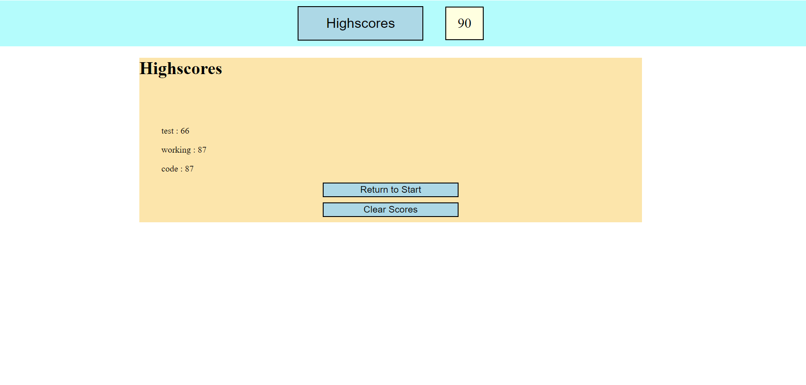

# Code_Quiz_NEJ
-Description-

    This application gives the user a short quiz on some

    basic CSS and Javascript essentials. It then allows the user
    
    to store their username and score, which will be saved after they close the window.

-Main Technology-

    - Javascript

-Collaborators-

    - Nicholas Jones

-Link-

https://njscc.github.io/code_quiz_NEJ/ 

-Screenshot-

